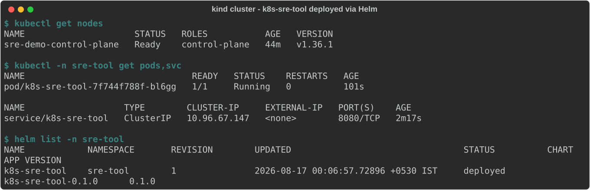
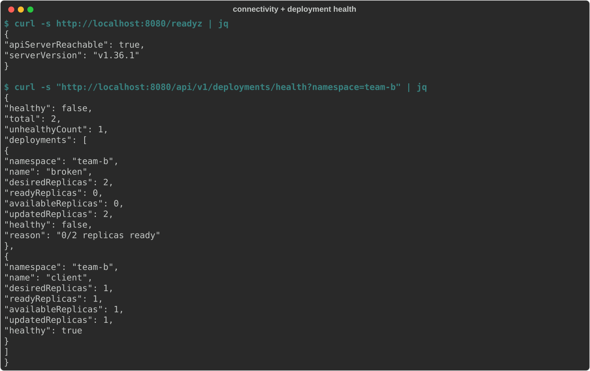
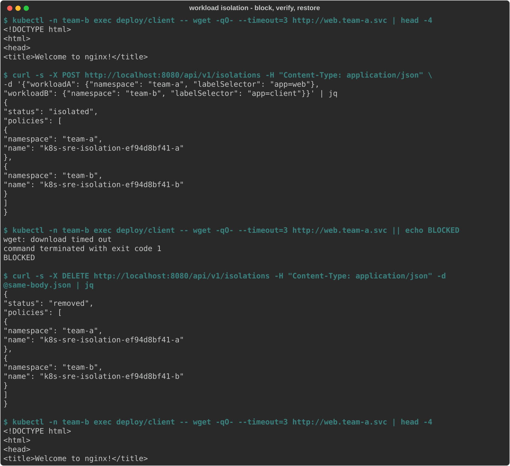
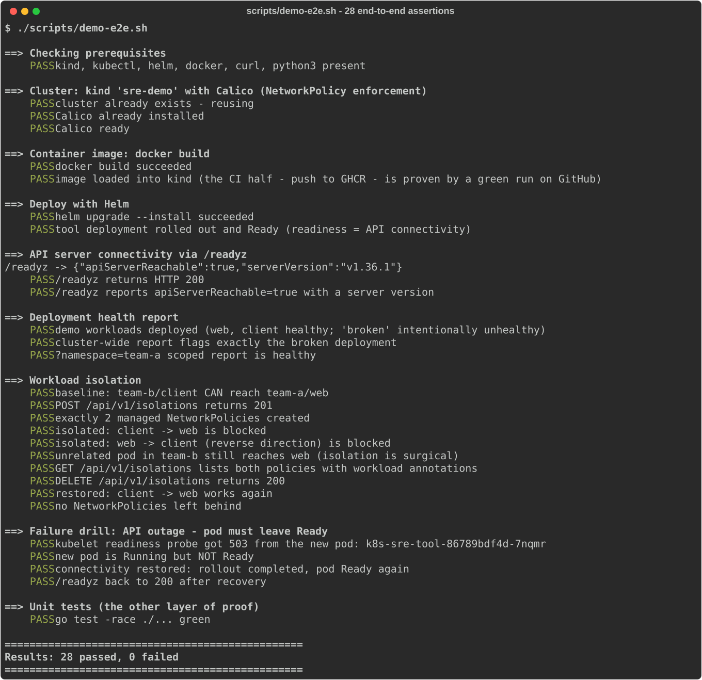

# SRE tooling 

This repository extends the provided Go tool into a single deployable service
covering all five user stories:

1. **Deployment health** - `GET /api/v1/deployments/health` reports whether every
   Deployment has as many ready pods as its spec requests, cluster-wide or per
   namespace.
2. **Workload isolation** - `POST/DELETE /api/v1/isolations` blocks (and
   restores) all network activity between two workloads defined by namespace +
   label selector, using paired NetworkPolicies.
3. **Connectivity** - `GET /readyz` performs a live API-server check and backs
   the pod's readiness probe, so the cluster continuously reflects whether the
   tool can talk to the API server.
4. **CI/CD** - GitHub Actions tests every push and builds + pushes a
   multi-arch container image to GHCR on every push to `main`.
5. **Helm** - the chart in `helm/k8s-sre-tool` deploys the tool with
   least-privilege RBAC.

The provided code was extended in place, not replaced: the original version
check lives on as `GetServerVersion` in
[`internal/k8s/client.go`](golang/internal/k8s/client.go), the `/healthz`
handler in [`internal/api/handlers.go`](golang/internal/api/handlers.go), the
original CLI flags are unchanged, and the original tests were preserved and
moved alongside the code they cover.

## Table of Contents

1. [API](#api)
2. [Build and test](#build-and-test)
3. [Run everything on a local cluster](#run-everything-on-a-local-cluster)
4. [How workload isolation works](#how-workload-isolation-works)
5. [Design decisions and trade-offs](#design-decisions-and-trade-offs)
6. [Notes on the brief](#notes-on-the-brief)
7. [Screenshots](#screenshots)

## API

| Method | Path | Purpose |
|---|---|---|
| `GET` | `/healthz` | Liveness of the tool itself |
| `GET` | `/readyz` | Live API server connectivity: `200` + version, or `503` + error |
| `GET` | `/api/v1/deployments/health` | Desired vs ready replicas for all Deployments (`?namespace=` to scope) |
| `POST` | `/api/v1/isolations` | Create the NetworkPolicies isolating two workloads |
| `DELETE` | `/api/v1/isolations` | Remove them (same body as `POST`) |
| `GET` | `/api/v1/isolations` | List all policies managed by this tool |

Isolation request body (`POST` and `DELETE`):

```json
{
  "workloadA": {"namespace": "team-a", "labelSelector": "app=web"},
  "workloadB": {"namespace": "team-b", "labelSelector": "app=client"}
}
```

## Build and test

Requires Go 1.23+.

```bash
cd golang
go build -o sre-tool .
go test -race -cover ./...
```

Run against any reachable cluster (leave `--kubeconfig` empty in-cluster):

```bash
./sre-tool --kubeconfig ~/.kube/config --address ":8080"
```

## Run everything on a local cluster

**One command** (provisions kind + Calico, builds, deploys via Helm, then
verifies every story with 28 explicit assertions including the negative paths):

```bash
./scripts/demo-e2e.sh
```

Or step by step - see [DEMO.md](DEMO.md) for the guided version with expected
output at each stage. The short form:

```bash
# 1. cluster with a CNI that enforces NetworkPolicy (see Notes on the brief)
kind create cluster --name sre-demo --config deploy/kind-config.yaml
kubectl apply -f https://raw.githubusercontent.com/projectcalico/calico/v3.28.2/manifests/calico.yaml
kubectl -n kube-system rollout status daemonset/calico-node --timeout=240s

# 2. build + deploy
docker build -t k8s-sre-tool:dev .
kind load docker-image k8s-sre-tool:dev --name sre-demo
helm install k8s-sre-tool helm/k8s-sre-tool \
  --namespace sre-tool --create-namespace \
  --set image.repository=k8s-sre-tool --set image.tag=dev
kubectl -n sre-tool port-forward svc/k8s-sre-tool 8080:8080 &

# 3. story 3: connectivity
curl -s http://localhost:8080/readyz | jq

# 4. story 1: deployment health (demo.yaml includes an intentionally broken Deployment)
kubectl apply -f deploy/demo.yaml
curl -s http://localhost:8080/api/v1/deployments/health | jq

# 5. story 2: isolate, prove the cut, restore
kubectl -n team-b exec deploy/client -- wget -qO- --timeout=3 http://web.team-a.svc | head -4
curl -s -X POST http://localhost:8080/api/v1/isolations -H 'Content-Type: application/json' \
  -d '{"workloadA": {"namespace": "team-a", "labelSelector": "app=web"},
       "workloadB": {"namespace": "team-b", "labelSelector": "app=client"}}' | jq
kubectl -n team-b exec deploy/client -- wget -qO- --timeout=3 http://web.team-a.svc || echo BLOCKED
curl -s -X DELETE http://localhost:8080/api/v1/isolations -H 'Content-Type: application/json' \
  -d '{"workloadA": {"namespace": "team-a", "labelSelector": "app=web"},
       "workloadB": {"namespace": "team-b", "labelSelector": "app=client"}}' | jq
```

Stories 4 and 5 demonstrate themselves: the Actions tab shows the pipeline
(test, helm lint, image build + push to GHCR on `main`), and Helm is how the
tool was deployed above.

## How workload isolation works

NetworkPolicies are allow-lists - there is no "deny traffic from X"
primitive - so "block exactly A<->B" is expressed as its complement: allow
ingress from everyone *except* the other workload. The tool creates one
ingress policy per side. The policy protecting workload A selects A's pods
and allows ingress from the union of:

- all pods in namespaces other than B's (`kubernetes.io/metadata.name NotIn [ns-b]`), and
- for each `key=value` in B's selector, pods in B's namespace that do **not**
  carry that value (`key NotIn [value]`, which also matches pods missing the
  key entirely).

The union of the per-label negations is exactly the complement of B's
selector conjunction. The mirror policy protects B from A. Blocking ingress
on both sides blocks connections initiated in either direction - sufficient
to prevent any exchange - while leaving all other traffic untouched.

Policies get deterministic hash-derived names (idempotent apply; `DELETE`
removes exactly what `POST` created), a
`app.kubernetes.io/managed-by=k8s-sre-tool` label, and annotations recording
both workload definitions.

## Design decisions and trade-offs

- **Ingress-only isolation.** Egress rules would require allow-listing DNS,
  the API server and everything else the workloads legitimately need - far
  more invasive. Known trade-off: an isolated workload also stops accepting
  traffic from outside the cluster (e.g. via LoadBalancer) for the duration;
  the `ipBlock` alternative behaves differently per CNI and could silently
  re-open the hole being closed.
- **Equality-based selectors only** (`app=web,tier=db`). `NotIn` can negate
  `key=value`; nothing can negate an arbitrary set expression, so set-based
  selectors are rejected with `400` rather than isolating the wrong pods.
- **Deployment health = `readyReplicas == spec.replicas`** (nil defaults to 1
  per the API contract). Scaled-to-zero is healthy: it has exactly as many
  pods as requested.
- **Log-and-serve startup.** The provided boilerplate panicked when the API
  server was unreachable; this was changed so the tool starts and reports the
  outage via `/readyz` instead of crash-looping during it (see Notes below).
- **Structure**: `internal/k8s` (cluster logic, tested against fake
  clientsets, including failure paths via reactors) and `internal/api` (HTTP
  layer, tested with `httptest` over the real router); `main.go` is wiring
  plus graceful shutdown. Dependencies upgraded to Go 1.23 / client-go v0.31.

## Notes on the brief

Things spotted while implementing, offered in the spirit of the brief's
invitation to critique it:

1. **"Always know" (story 3) is physically bounded.** A live connectivity
   check cannot detect a partition that only blocks *new* connections:
   client-go holds a persistent connection to the API server and CNIs do not
   cut established conntrack flows. This was observed empirically during
   testing - an egress-deny policy left `/readyz` green until the pod was
   restarted, after which the fresh pod correctly failed its readiness probe
   with a 503. The chosen design (live check + readiness probe) makes the
   signal continuous and alertable, but "always" has a detection lag equal to
   the lifetime of the established connection. Any implementation of this
   story has this property; it deserves to be documented rather than hidden.
2. **The provided boilerplate contradicts story 3.** It panicked at startup
   when the API server was unreachable - a connectivity-reporting tool that
   dies during the exact outage it exists to report. Changed to start-and-serve.
3. **Story 2's "label selectors" is broader than NetworkPolicy can express.**
   Denying traffic requires stating the complement of a selector, and only
   equality-based selectors have an expressible complement (per-label
   `NotIn`). Set-based expressions (`in (a,b)`, `!=`, exists) are therefore
   rejected loudly with `400`. If arbitrary selectors were a hard
   requirement, a different mechanism (an admission-time pod labeler, or a
   CNI-specific CRD such as Calico's GlobalNetworkPolicy with negation
   support) would be needed - at the cost of portability.
4. **"See each story working on kind" silently depends on a non-default CNI.**
   kind's default CNI (kindnet) does not enforce NetworkPolicy at all -
   policies are created and traffic keeps flowing, which would make story 2
   look done while doing nothing. The demo setup installs Calico for this
   reason, and the e2e suite proves enforcement by observing actual blocked
   traffic, not just the existence of policy objects.
5. **Story 1 leaves "healthy" underspecified** during rollouts: a deployment
   mid-rollout can be transiently below its desired ready count without being
   in trouble. The report deliberately surfaces this (it is the truth at that
   moment) rather than smoothing it; a monitoring consumer can add
   time-based tolerance on top.

## Screenshots

Real output captured from the running kind cluster.








